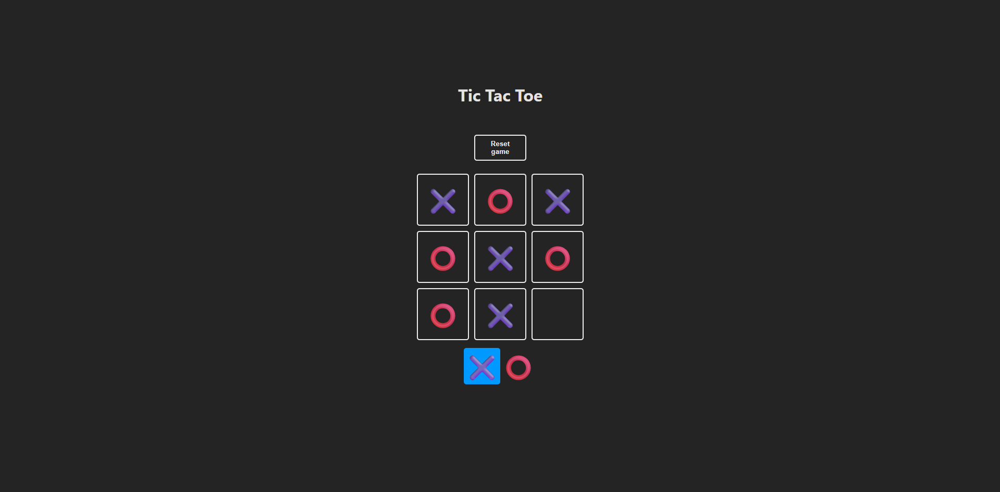

# Tic Tac Toe Game

A classic Tic Tac Toe game built with React and Vite. Play against yourself or a friend on the same screen. The game saves your progress in local storage, so you can pick up where you left off!



## How to Play

1. The game is played on a 3x3 grid.
2. Player 1 is 'X' and Player 2 is 'O'.
3. Players take turns putting their marks in empty squares.
4. The first player to get 3 of their marks in a row (up, down, across, or diagonally) is the winner.
5. If all 9 squares are full and no player has 3 marks in a row, the game ends in a tie.
6. Click the "Reset game" button to start a new game.

## Technologies Used

- **React:** A JavaScript library for building user interfaces.
- **Vite:** A fast build tool and development server for modern web projects.
- **JavaScript (ES6+):** Core programming language.
- **CSS:** For styling the components.
- **Local Storage:** To persist game state across browser sessions.

## Installation and Setup

To run this project locally, follow these steps:

1. **Clone the repository:**

   ```bash
   git clone <repository-url>
   cd tic-tac-toe
   ```

2. **Install dependencies:**

   ```bash
   npm install
   ```

   or

   ```bash
   yarn install
   ```

3. **Start the development server:**

   ```bash
   npm run dev
   ```

   or

   ```bash
   yarn dev
   ```

4. Open your browser and navigate to `http://localhost:5173` (or the port specified by Vite).

## Credits

This project was developed as part of the React course by **[Midudev](https://cursoreact.dev/02-use-state-use-effect)**. Special thanks for the guidance and learning resources provided throughout the course.
